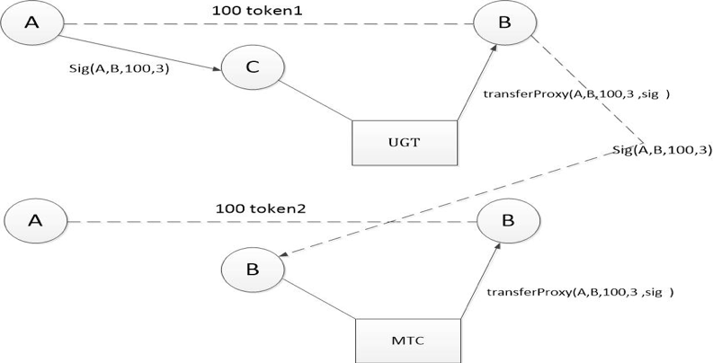
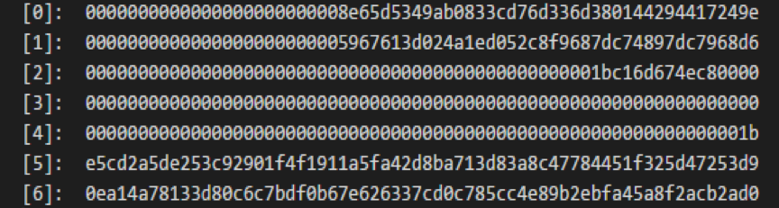
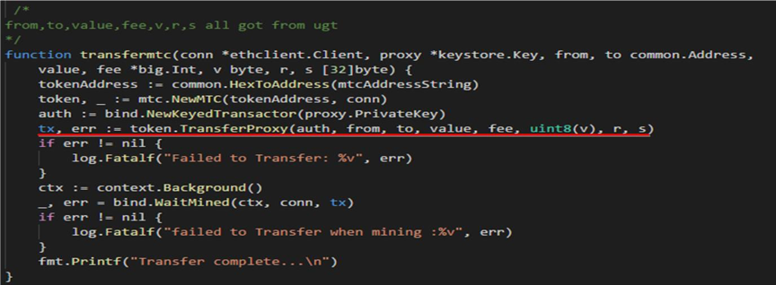
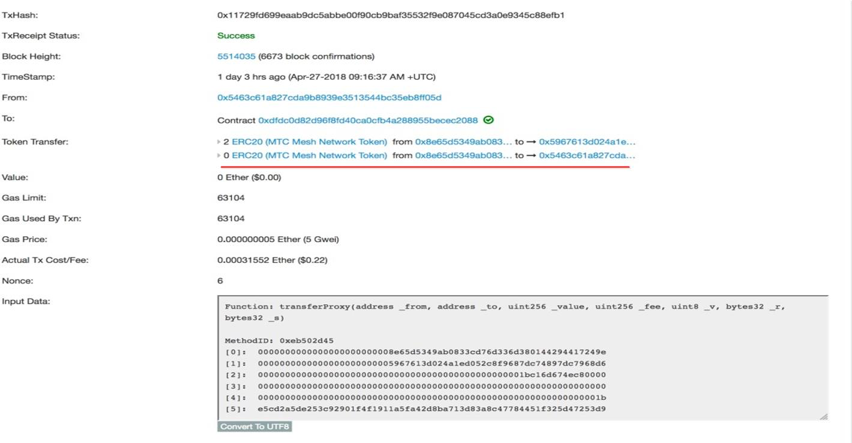
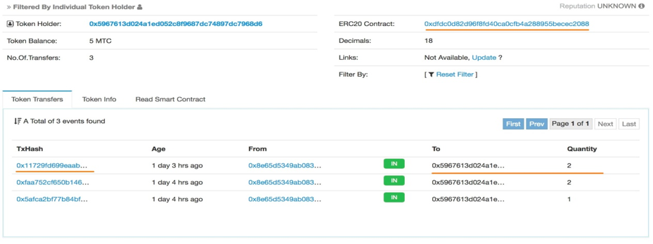

#  Replay Attacks on Ethereum Smart Contracts
An replay attack vulnerability in many smart contract inplementation, allows attackers to accomplish replay attack in two similar contracts , the reason is that many smart contracts adopt the same way to verify the validity of the signature, but the contents of the signature were not correctly limited by the smart contracts. Such as transfer proxy, the contents of the  UGT signature and the contents of the MTC signature are exactly the same. the attack process is as follow:

Suppose there is a transaction in “UGT”. User A wanted to transfer 100 tokens to user B through proxy C, and extra 3 tokens should be paid to proxy C as service fee. In this process, the signatures of user A should be used to sign on the A, B, 100, 3 and the latest nonce 1. Then the transfer were carried out by proxy C. After this transaction being completed, user B can get the 100 tokens from user A. 

Also suppose the user A doesn’t carry out the transfer in “MTC”.The latest nonce is 1.
## Replay attack starts.

After receiving 100 tokens from user A, user B replayed the signatures of user A in “MTC”(the signatures of user A does’t contain limited info, so user B can use again), he can get another 100 tokens in “MTC” without the permission of user A. That is to say, the smart contract “MTC” was attacked by user B, and 100 tokens of user A were stolen.

 Because of this vulnerability,userB can induce user A to use proxy transfers for getting more token in another contract(replay attack).
## Verification of the replay attack process:

### Step one
transaction records on the Ethereum were scanned to find out accounts which had both UGT tokens and MTC tokens. 
Since this attack is only a verification experiment, we use our own accounts, Alice and Bob, that is,
Alice(the sender): 0x8e65d5349ab0833cd76d336d380144294417249e
Bob(the receiver): 0x5967613d024a1ed052c8f9687dc74897dc7968d6
which own some tokens for transferring.

###  Step two
  Bob induced Alice to send him 2 UGT tokens. The transaction inputdata is shown as below:
Function: transferProxy(address _from, address _to, uint256 _value, uint256 _feeUgt, uint8 _v, bytes32 _r, bytes32 _s)

### Step three
  Bob take out the inputdata of this transaction on the blockchain. The parameters ”from, to, value, fee, v, r, s” were extracted from [0]- [6] in step two. The following is the implementation of the transfer function. 
  

### Step four
  Bob use the inputdata in step 2 to execute another transfer in the smart contract of MTC. The result of this transaction is shown as below.
  

###  Step five
  Bob got not only 2 UGT tokens but also 2 MTC tokens from Alice. In this process, the transfer of 2 MTC tokens was not authorized by Alice.
   
## Other related contracts

* [ M2C Mesh Network (mesh) 0x3AC6cb00f5a44712022a51fbace4C7497F56eE31](https://etherscan.io/address/0x3AC6cb00f5a44712022a51fbace4C7497F56eE31#code)
* [ M2C Mesh Network (MTC) 0x8feBf7551EeA6Ce499F96537Ae0e2075c5A7301a](https://etherscan.io/address/0x8feBf7551EeA6Ce499F96537Ae0e2075c5A7301a#code)
* [ First (FST) 0x9E88770DA20ebea0Df87aD874c2F5cf8ab92f605](https://etherscan.io/address/0x9E88770DA20ebea0Df87aD874c2F5cf8ab92f605#code)
* [GG Token (GG) 0xF20b76Ed9d5467fDcDc1444455e303257d2827c7](https://etherscan.io/address/0xF20b76Ed9d5467fDcDc1444455e303257d2827c7#code)
* [UG Token (UGT) old 0x43ee79e379e7b78d871100ed696e803e7893b644](https://etherscan.io/address/0x43ee79e379e7b78d871100ed696e803e7893b644#code)
